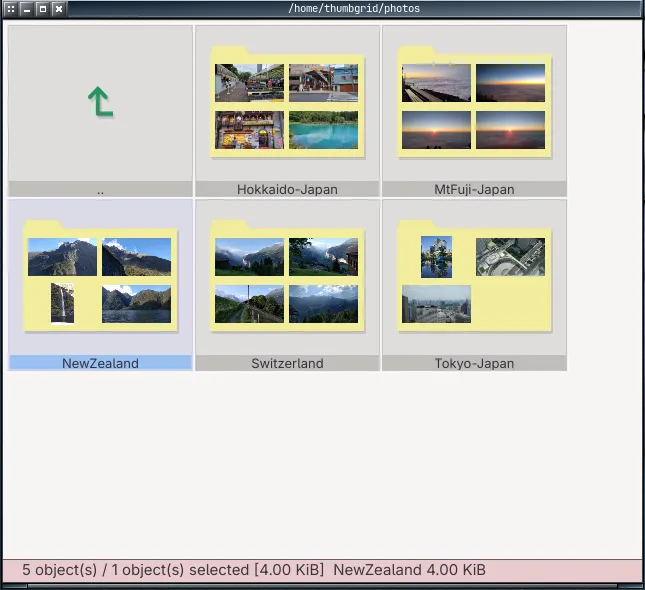
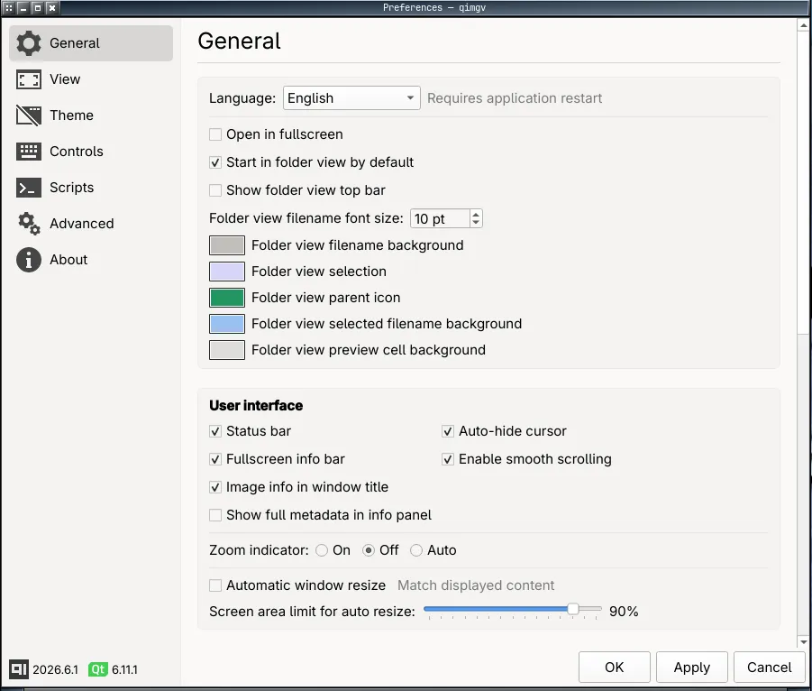

## :exclamation: Updates may be slow due to war in Ukraine :sunflower: :sunflower: :sunflower:

thumbgrid
=====
Image viewer. Fast, easy to use. Optional video support.

> **thumbgrid** is a hard fork of [easymodo/qimgv](https://github.com/easymodo/qimgv),
> originally written by easymodo and its contributors. It remains free software
> under the GNU GPL v3. The original copyright and attribution are retained — see
> [`NOTICE`](NOTICE) and [`LICENSE`](LICENSE).

**Versioning:** thumbgrid uses calendar versioning (`YYYY.M.N`), independent of
upstream. The current version is defined in
[`qimgv/appversion.cpp`](qimgv/appversion.cpp) and `CMakeLists.txt`
(currently **2026.6.1**), and is reported by `thumbgrid --version`.

## Screenshots

Main window         |  Folder view   |  Thumbnails  |  Settings window  
:------------------:|:--------------:|:------------:|:-----------------:|
[](qimgv/distrib/screenshots/image.webp?raw=true) | [](qimgv/distrib/screenshots/folder-view.webp?raw=true) | [](qimgv/distrib/screenshots/thumbnails.webp?raw=true) | [](qimgv/distrib/screenshots/preference.webp?raw=true)

## Key features:

- Simple UI

- Fast

- Easy to use

- Fully configurable, including themes, shortcuts

- High quality scaling

- Basic image editing: Crop, Rotate and Resize

- EXIF/IPTC/XMP metadata via exiv2: view tags (with an optional full-metadata
  mode), preserve metadata when saving edits, and strip all metadata for privacy

- Folder view with file management: copy / cut / paste of files and folders
  (symlink-aware), create directory (F7), rename (F2), and an on-disk async
  folder thumbnail cache

- Ability to quickly copy / move images to different folders

- Experimental video playback via libmpv

- Folder view mode

- Ability to run shell scripts

- Qt6-only build (upstream Qt5 support has been dropped)

## Default control scheme:

| Action  | Shortcut |
| ------------- | ------------- |
| Next image  | Right arrow / MouseWheel |
| Previous image  | Left arrow / MouseWheel |
| Goto first image  | Home |
| Goto last image  | End |
| Zoom in  | Ctrl+MouseWheel / Crtl+Up |
| Zoom out  | Ctrl+MouseWheel / Crtl+Down |
| Zoom (alt. method) | Hold right mouse button & move up / down |
| Fit mode: window | 1 |
| Fit mode: width | 2 |
| Fit mode: 1:1 (no scaling) | 3 |
| Switch fit modes  | Space |
| Toggle fullscreen mode  | DoubleClick / F / F11 |
| Exit fullscreen mode | Esc |
| Show EXIF panel  | I |
| Crop image  | X |
| Resize image  | R |
| Rotate left  | Ctrl+L |
| Rotate Right  | Ctrl+R |
| Open containing directory | Ctrl+D |
| Slideshow mode | ~ |
| Shuffle mode | Ctrl+~ |
| Quick copy  | C |
| Quick move  | M |
| Move to trash | Delete |
| Delete file  | Shift+Delete |
| Save  | Ctrl+S |
| Save As  | Ctrl+Shift+S |
| Folder view | Enter / Backspace |
| Open | Ctrl+O |
| Print / Export PDF | Ctrl+P |
| Settings  | P |
| Exit application | Esc / Ctrl+Q / Alt+X / MiddleClick |

... and more.

Note: you can configure every shortcut by going to __Settings > Controls__

# User interface

The idea is to have a uncluttered, simple and easy to use UI. You can see UI elements only when you need them.

There is a pull-down panel with thumbnails, as well as folder view. You can also bring up a context menu via right click.

## Using quick copy / quick move panels

Bring up the panel with C or M shortcut. You will see 9 destination directories, click on the folder icon to change them.

With panel visible, use 1 - 9 keys to copy/move current image to corresponding directory.

When you are done press C or M again to hide the panel.

## Folder view & file management

In folder view you can manage files directly: copy / cut / paste files and
folders (symlink-aware), create a new directory (F7) and rename (F2). Thumbnails
are cached on disk and generated asynchronously.

## Metadata (exiv2)

When built with exiv2 support (`-DEXIV2=ON`, default), thumbgrid can read
Exif / IPTC / XMP tags. The image-info panel (`I`) has an optional full-metadata
mode. Metadata is preserved when saving edits, and a strip-metadata action lets
you remove all metadata for privacy. Both are available from the context menu.

## Running scripts

You can run custom scripts on a current image.

Open __Settings > Scripts__. Press Add. Here you can choose between a shell command and a shell script. 

Example of a command: 

`convert %file% %file%_.pdf`

Example of a shell script file (`$1` will be image path): 
```
#!/bin/bash
gimp "$1"
```
_Note: The script file must be an executable. Also, "shebang" (`#!/bin/bash`) needs to be present._

When you've created your script go to __Settings > Controls > Add__, then select it and assign a shortcut like for any regular action.

## HiDPI (Linux / MacOS only)

If thumbgrid appears too small / too big on your display, you can override the scale factor. Example:
```
QT_SCALE_FACTOR="1.5" thumbgrid /path/to/image.png
```
You can put it in `thumbgrid.desktop` file to make it permanent. Using values less than `1.0` is not supported.

thumbgrid should also obey the global scale factor set in KDE's systemsettings.

## High quality scaling

thumbgrid supports nicer scaling filters when compiled with `opencv` support (ON by default, but might vary depending on your linux distribution). Filter options are available in __Settings > Scaling__. `Bicubic` or `bilinear+sharpen` is recommended.

# Additional image formats

thumbgrid can open some extra formats via third-party image plugins.

| Format  | Plugin |
| ------- | ------------- |
| WebP | Qt ImageFormats (`qt6-imageformats` / `qt6-image-formats-plugins`) |
| JPEG-XL | [github.com/novomesk/qt-jpegxl-image-plugin](https://github.com/novomesk/qt-jpegxl-image-plugin) |
| AVIF | [github.com/novomesk/qt-avif-image-plugin](https://github.com/novomesk/qt-avif-image-plugin) |
| APNG | [github.com/Skycoder42/QtApng](https://github.com/Skycoder42/QtApng) |
| HEIF / HEIC | [github.com/jakar/qt-heif-image-plugin](https://github.com/jakar/qt-heif-image-plugin) |
| RAW | [https://gitlab.com/mardy/qtraw](https://gitlab.com/mardy/qtraw) |

# Installation

This fork does not yet ship to the upstream distribution channels (AUR
`qimgv-git`, apt/dnf/zypper/pkg, Chocolatey, WinGet). Build from source, or grab
a CI-built package from the fork's releases.

## Build from source (GNU+Linux)

Requirements: a C++17 compiler (GCC 9+), CMake 3.13+, and Qt6
(`Core Widgets Svg PrintSupport OpenGLWidgets`). Optional features pull in
exiv2 (metadata), OpenCV (HQ scaling) and mpv (video).

The easiest way is the interactive helper, which can install the minimal Qt6
build dependencies for your distro and then configure / build / run:

```
./run.sh
```

Or build directly with CMake:

```
cmake -B build -S . -DCMAKE_BUILD_TYPE=Release
cmake --build build --parallel
```

Feature toggles (all default `ON` except KDE):

```
-DEXIV2=ON|OFF            # Exif/Iptc/Xmp metadata, metadata-preserving saves, strip-metadata
-DVIDEO_SUPPORT=ON|OFF    # video playback via the mpv plugin
-DOPENCV_SUPPORT=ON|OFF   # high quality scaling
-DKDE_SUPPORT=ON|OFF      # blur behind the window on KDE
```

Install with:

```
sudo cmake --install build
```

## Arch Linux package

A minimal Qt6 PKGBUILD lives in [`packaging/arch/`](packaging/arch/). From that
directory:

```
makepkg -si
```

CI also builds this package and attaches a `*.pkg.tar.zst` to the release on
every version tag.

# Donate

If you wish to give a few bucks, please consider donating to the Ukrainian Army:

[https://savelife.in.ua/en/donate-en/#donate-army-card-once](https://savelife.in.ua/en/donate-en/#donate-army-card-once)

[https://u24.gov.ua/](https://u24.gov.ua/)
